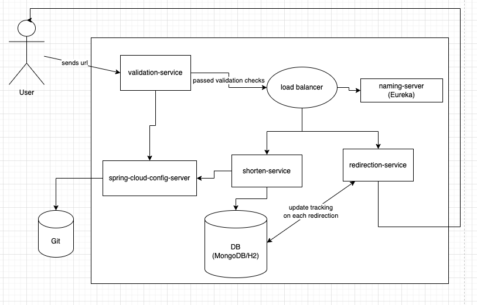

# URL-Shortner-Java-Spring-Boot-Microservices-Project

## Introduction:

This is a project i have created based on a nodejs project i created for fun a while back: https://github.com/suraj200981/URLShortener--Full-Stack-MEVN-Project

This old nodejs project had a monolithic architecture so i have decided to recreate it with a modern microservices architecture.

## Backend architecture:

### Interface:

https://github.com/suraj200981/urlshortener-interface

### Validation Microservice:

https://github.com/suraj200981/URL-Shortner-validation-service

### Shortener Microservice:

https://github.com/suraj200981/URL-Shortner-validation-service

### Redirection Microservice:

https://github.com/suraj200981/redirection-service

